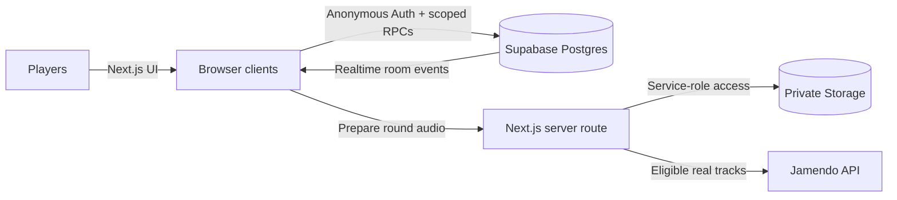

# Banger or Bot

[](https://github.com/Avivmorad/Banger_or_Bot/actions/workflows/ci.yml)
[](https://nextjs.org/)
[](https://www.typescriptlang.org/)
[](https://supabase.com/)

Banger or Bot is a real-time multiplayer party game where players hear
a short music clip and decide whether it was made by a human or generated by an
algorithm. One player hosts a room, guests join with a six-character code, and
every round resolves from authoritative server time and scoring.

**[Play the live game](https://banger-or-bot.vercel.app)** ·
**[View the source](https://github.com/Avivmorad/Banger_or_Bot)**

## Contents

- [Try it](#try-it)
- [Features](#features)
- [How it works](#how-it-works)
- [Architecture](#architecture)
- [Local development](#local-development)
- [Game rules and scoring](#game-rules-and-scoring)
- [Verification](#verification)
- [Database operations](#database-operations)
- [Deployment](#deployment)
- [Known limitations](#known-limitations)

## Try it

1. Open the [live game](https://banger-or-bot.vercel.app) and enter a nickname.
2. Host a room, then invite friends using the room code; solo play is also supported.
3. Ready up, listen to each clip and choose **Human** or **AI** before time runs out.

## Features

- Anonymous create/join flow for up to eight players
- Live lobby, ready states, host settings, player removal, and host transfer
- Per-round private audio preparation with synchronized player readiness
- Server-authoritative deadlines, scoring, reveals, and leaderboard ordering
- Reconnect support, absent-answer handling, final results, and play again
- Responsive keyboard-accessible UI with reduced-motion support
- Private track answers and admin operations protected behind Supabase RPCs

## How it works

1. **Create or join:** a host creates a room and shares its six-character code.
2. **Get ready:** players ready up while the host chooses the game settings.
3. **Listen and vote:** each synchronized round asks whether a clip is human-made or AI-generated.
4. **Reveal and rank:** the server reveals the answer, awards points, and publishes the leaderboard.
5. **Finish or replay:** the final standings appear after the last round, and the room can play again.

The server—not the browser—decides deadlines, accepted answers, scores, and
results. Realtime notifications tell clients when state changed; clients then
request a fresh authoritative snapshot.

## Architecture

The repository is intentionally split by responsibility:

- `client/` — Next.js App Router application, browser game client, trusted track
  preparation routes, unit/integration/browser tests, and generated database types
- `server/` — Supabase migrations, database tests, local configuration, and track
  administration documentation

The browser signs in with Supabase Anonymous Auth and can only call a narrow set
of security-definer RPCs. Row Level Security denies direct access to authoritative
tables. Track answers remain in the private schema until the reveal RPC returns
them. Realtime room events prompt clients to fetch a fresh server state snapshot.
No service-role key or database credential is shipped to the browser.



**Stack:** Next.js, React, TypeScript, Supabase Auth/Postgres/Realtime/Storage,
Vitest, Playwright, and Vercel.

## Local development

Requirements: Node.js 22 or newer and npm 10 or newer. A Docker-compatible
container runtime is needed only for the optional local Supabase stack.

```sh
git clone https://github.com/Avivmorad/Banger_or_Bot.git
cd Banger_or_Bot
cp .env.example client/.env.local
cd client
npm ci
```

Set these values in `client/.env.local`:

```dotenv
NEXT_PUBLIC_SUPABASE_URL=https://YOUR_PROJECT_REF.supabase.co
NEXT_PUBLIC_SUPABASE_PUBLISHABLE_KEY=YOUR_PUBLISHABLE_KEY
NEXT_PUBLIC_SITE_URL=http://localhost:3000
SUPABASE_SERVICE_ROLE_KEY=YOUR_SERVER_ONLY_SERVICE_ROLE_KEY
JAMENDO_CLIENT_ID=YOUR_JAMENDO_CLIENT_ID
```

| Variable                               | Visibility  | Purpose                                                        |
| -------------------------------------- | ----------- | -------------------------------------------------------------- |
| `NEXT_PUBLIC_SUPABASE_URL`             | Browser     | Supabase project URL                                           |
| `NEXT_PUBLIC_SUPABASE_PUBLISHABLE_KEY` | Browser     | Publishable key used with anonymous authentication             |
| `NEXT_PUBLIC_SITE_URL`                 | Browser     | Canonical application URL; use `http://localhost:3000` locally |
| `SUPABASE_SERVICE_ROLE_KEY`            | Server only | Private Storage and track-preparation access                   |
| `JAMENDO_CLIENT_ID`                    | Server only | Fetches eligible human-made tracks                             |

Never expose either server-only value with a `NEXT_PUBLIC_` prefix or commit
`client/.env.local`.

Enable Anonymous Sign-Ins in Supabase Auth, apply the migrations under
`server/supabase/migrations/`, then start the app:

```sh
npm run dev
```

The local site is available at http://localhost:3000.

### Repository layout

```text
.
├── client/                  # Next.js application and automated tests
│   ├── e2e/                 # Playwright multiplayer flows
│   ├── public/audio/        # Local demo fixtures
│   ├── src/                 # App Router pages, UI, hooks, and game clients
│   └── tests/               # Vitest unit and integration suites
└── server/
    ├── scripts/             # Trusted track administration
    └── supabase/            # Config, migrations, seed data, and pgTAP tests
```

## Verification

Run from `client/`:

```sh
npm run format:check
npm run lint
npm run check
npm run test
npm run test:integration
npm run build
npm run test:e2e
```

`test:integration` requires the dedicated `E2E_SUPABASE_URL`,
`E2E_SUPABASE_PUBLISHABLE_KEY`, and `E2E_SUPABASE_SERVICE_ROLE_KEY` values from
`.env.example`. The browser suite uses the normal app variables and starts a
local Next.js server automatically unless `E2E_BASE_URL` points to an existing
deployment. SQL pgTAP coverage lives in
`server/supabase/tests/schema.test.sql`.

GitHub Actions currently runs format checking, linting, the client check command,
unit tests, and the production build. The multiplayer integration suite,
Playwright browser tests, and SQL pgTAP tests are available in the repository
but are not part of the current GitHub Actions CI job.

The application also exposes `GET /api/health` for deployment health checks.

## Game rules and scoring

The host chooses the round count, answer duration, reveal duration, and whether
wrong answers lose points. A single ready player can start solo; every player
present in a multiplayer room must be connected and ready.

Each game receives a hidden balanced real/AI plan. Real rounds download eligible
Creative Commons tracks from Jamendo. AI rounds select only enabled owned Suno
exports imported through `server/TRACKS.md`. Audio is cached in private Supabase
Storage and acknowledged by every connected browser before countdown begins.

- Correct answer: 1,000 base points plus up to 2,000 speed points
- Wrong answer: 0 points, or -500 when negative scoring is enabled
- No answer before the server deadline: 0 points
- Ties share a rank; later positions skip accordingly

Every included demo track is an original project asset released under CC0-1.0.
Neutral filenames prevent answer leakage. See `server/TRACKS.md` for the secure
track-import and administrator workflow.

## Database operations

From `server/`, use the pinned Supabase CLI:

```sh
npm ci
npm run db:start
npm run db:reset
npm run db:lint
npm run db:test
```

Production migrations should be reviewed, applied in order, followed by the
Supabase security and performance advisors. Expired rooms can be removed with
the private `cleanup_expired_rooms` function from a trusted scheduled backend
job. Do not expose that operation or any service-role credential to the client.

## Deployment

The public app is available at `https://banger-or-bot.vercel.app`. The Vercel
configuration uses `client/` as its root directory and deploys `main` to production. Pull requests receive
isolated preview deployments through the GitHub integration. Configure the
public variables plus the server-only `SUPABASE_SERVICE_ROLE_KEY` and
`JAMENDO_CLIENT_ID` in Vercel for Production, Preview, and Development. Never
prefix either secret with `NEXT_PUBLIC_`.

The deployed game uses its dedicated legacy-named Supabase project. It does not
share resources or credentials with other
applications.

For track ingestion and administrator operations, see [`server/TRACKS.md`](server/TRACKS.md).
For local database details, see [`server/README.md`](server/README.md).

## Known limitations

- The six original project tracks are local/test fixtures and are not selected
  by the production dynamic pack.
- Jamendo audio stays cached until manually removed; automatic cache eviction is
  not included yet.
- Anonymous Auth is convenient for a party game but should be paired with
  Supabase rate limits and CAPTCHA before operating at untrusted public scale.
- Automatic expired-room cleanup requires an external trusted schedule.
